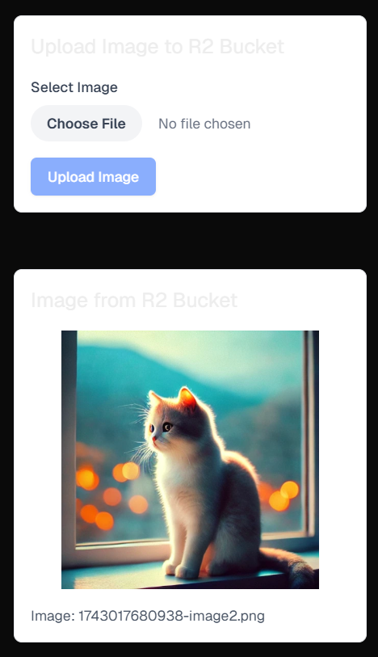

# Display Cloudflare R2 Image

[](https://nextjs.org/)
[](https://reactjs.org/)
[](https://www.typescriptlang.org/)
[](https://tailwindcss.com/)
[](https://developers.cloudflare.com/r2/)

A modern web application prototype that demonstrates image storage and retrieval using **Cloudflare R2** storage service. Built with Next.js, React, and TypeScript.

## Screenshot



_Image upload interface and display from Cloudflare R2 bucket_

## Features

- 🖼️ **Image Display**: Display images stored in Cloudflare R2 with optimized loading
- 🖼️ **Image Upload**: Upload images to Cloudflare R2 storage with preview functionality
- 🔄 **Real-time Preview**: Preview images before uploading
- 📊 **Upload Status**: Real-time feedback on upload progress and status
- 🔒 **Secure Storage**: Images are securely stored in Cloudflare R2
- 🌙 **Basic Dark Mode**: System color scheme detection for basic dark mode support with @media (prefers-color-scheme: dark)

## Tech Stack

- **Framework**: Next.js 15.2.3
- **Storage**: Cloudflare R2
- **AWS SDK**: @aws-sdk/client-s3 (for S3-compatible API interactions with Cloudflare R2)

## Setting up Cloudflare R2

1. Sign up for a Cloudflare account at [cloudflare.com](https://cloudflare.com)
2. Navigate to the R2 section in your Cloudflare dashboard
3. Create a new R2 bucket:
   - Click "Create bucket"
   - Give your bucket a unique name
   - Choose a region (if applicable)
4. Create API tokens:
   - Go to "Manage R2 API Tokens"
   - Click "Create API Token"
   - Select the appropriate permissions (read/write access)
   - Save the Access Key ID and Secret Access Key

## Environment Variables

Create a `.env` file with the following variables:

```env
NEXT_PUBLIC_CLOUDFLARE_R2_ACCESS_KEY_ID=your_access_key_id_here
NEXT_PUBLIC_CLOUDFLARE_R2_SECRET_ACCESS_KEY=your_secret_access_key_here
NEXT_PUBLIC_CLOUDFLARE_R2_ENDPOINT=your_r2_endpoint_url_here
NEXT_PUBLIC_CLOUDFLARE_R2_BUCKET_NAME=your_bucket_name_here
```

## Getting Started

1. Clone the repository
2. Install dependencies:
   ```bash
   npm install
   ```
3. Create a `.env` file based on `example.env` and add your Cloudflare R2 credentials
4. Run the development server:
   ```bash
   npm run dev
   ```

## License

MIT
